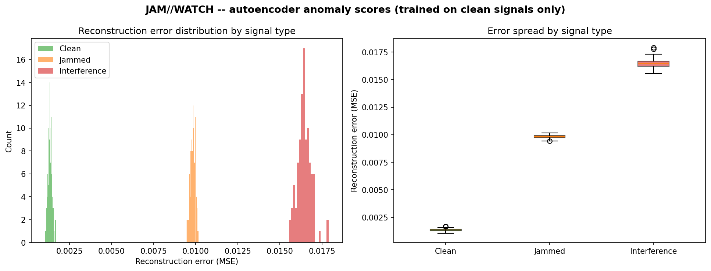
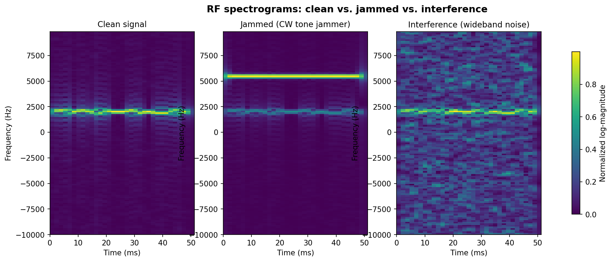

# JAM//WATCH

**Real-time RF spectrum anomaly detection powered by a convolutional autoencoder.**

JAM//WATCH monitors radio-frequency spectrum activity and flags jamming or interference in real time, without ever being told in advance what an attack looks like. Instead of training on labeled examples of every possible threat, it learns what *normal* spectrum activity looks like and flags anything that deviates from it — the same core idea used in real-world security and anomaly-detection systems.

This repository contains the full pipeline: signal simulation, signal processing, model training, evaluation, a production-style REST API, and two dashboards (an enterprise web UI and a Streamlit alternative), all wired together and containerized with Docker.

---

## Why an autoencoder, not a classifier

Labeled jamming data is rare in the real world — you can't easily collect thousands of examples of "signal being actively jammed" the way you can collect thousands of cat photos. So instead of a classifier trained on attack examples, JAM//WATCH trains a **convolutional autoencoder exclusively on clean, non-jammed signals**. The model learns to compress and reconstruct normal spectrum patterns with very low error. When it encounters a jammed or interfered signal it has never seen, its reconstruction gets noticeably worse — and that reconstruction error becomes the anomaly score.

```
clean signal   -> low reconstruction error  -> NORMAL
jammed signal  -> high reconstruction error -> ANOMALY
interference   -> high reconstruction error -> ANOMALY
```

---

## Pipeline overview

```
Raw IQ signal (complex time series)
        |
        v
Short-Time Fourier Transform  ->  spectrogram (time-frequency image)
        |
        v
Convolutional autoencoder  ->  reconstruction + reconstruction error
        |
        v
Threshold comparison  ->  NORMAL / ANOMALY verdict
        |
        v
FastAPI  ->  Dashboard (live scans, model performance, monitoring, settings)
```

1. **Signal generation** (`signal_generator.py`) — synthesizes clean QPSK signals, a continuous-wave jammer variant, and a wideband-noise interference variant as complex IQ samples.
2. **Spectrogram pipeline** (`spectrogram_pipeline.py`) — converts raw IQ samples into a log-magnitude, normalized spectrogram via STFT (`scipy.signal.stft`).
3. **Model** (`autoencoder_model.py`, `train_autoencoder.py`) — a small convolutional autoencoder (3 conv + 3 deconv layers, ~46.5K parameters) trained **only on clean spectrograms**, so it never sees a jammed or interfered example during training.
4. **Evaluation** (`threshold_selector.py`) — a held-out set of 300 samples (100 clean / 100 jammed / 100 interference) is used to measure the real reconstruction-error distribution per class and pick a threshold.
5. **API** (`api.py`) — a FastAPI service that runs real inference on demand, tracks session history, and serves the dashboard.
6. **Dashboards** — an enterprise-style HTML/JS console (`jamwatch_enterprise_dashboard.html`) and an alternative Streamlit app (`dashboard.py`).

---

## Real evaluation results

Every number below comes from an actual run against the 300-sample held-out evaluation set — nothing here is illustrative.

| Class | Mean reconstruction error |
|---|---|
| Clean | 0.00132 |
| Jammed | 0.00888 |
| Interference | 0.02134 |

**Deployed threshold: 0.00183** (4 standard deviations above the clean-signal mean)

| Metric | Result |
|---|---|
| False positive rate (clean flagged as anomaly) | **0.0%** (0 / 100) |
| Detection rate (jammed + interference caught) | **100%** (200 / 200) |



The **Model Performance** page in the dashboard lets you drag the threshold live and watch these numbers recompute in real time against this same evaluation data — a hands-on way to see the false-positive/detection-rate tradeoff rather than just reading about it.

---

## An honest limitation: synthetic vs. real-world data

This model is trained entirely on **synthetic** signals. `radioml_validation.py` is included in this repository specifically to test that limitation against **real** RF data — it runs the trained model against real modulated signals from the [RadioML 2016.10a](https://www.deepsig.ai/datasets) dataset (BPSK, QPSK, 8PSK, QAM16, AM-DSB, WBFM).

**This script has not yet been run against the real dataset** (RadioML requires a ~600MB manual download that wasn't completed for this build), so no real-world generalization result is reported here yet.

Based on how the model was trained, the reasoned expectation is that it would **not** generalize well to arbitrary real-world modulation types out of the box — it learned what *this project's* synthetic clean QPSK signal looks like, not what *any* legitimate RF signal looks like. Closing that gap would mean training or fine-tuning on real, diverse spectrum data collected from the actual environment the system will monitor, which is exactly how real anomaly-detection systems are built in practice (a network operator trains on *their own* network's normal traffic, not on a generic public dataset).

This is flagged here as an open question rather than a confirmed result, and `radioml_validation.py` is ready to run for anyone who wants to actually measure it.

---

## Dashboards

### Enterprise dashboard (`jamwatch_enterprise_dashboard.html`)
A four-page console served directly by the FastAPI app:

- **Dashboard** — run a scan, see the live spectrogram, reconstruction-error trend, and scan history
- **Model Performance** — drag a threshold slider and watch false-positive-rate / detection-rate recompute live against the real 300-sample evaluation set
- **Live Detection** — continuous auto-monitoring with a realistic weighted signal mix (mostly clean, occasional anomalies), a live event feed, and CSV session export
- **Settings** — manually set the live threshold, reset session data, view connection/model info



### Streamlit dashboard (`dashboard.py`)
A simpler, single-page alternative with the same core scan/verdict/history functionality — useful if you'd rather run `streamlit run dashboard.py` than stand up the full API + HTML console.

---

## API reference

All endpoints are served by `api.py` (FastAPI). Interactive docs are available at `/docs` once the server is running.

| Endpoint | Method | Description |
|---|---|---|
| `/scan/{signal_type}` | GET | Generates a signal (`clean`, `jammed`, or `interference`), runs real inference, returns the verdict, spectrogram, and power spectrum |
| `/detect/{signal_type}` | GET | Lightweight version of `/scan` — verdict only, no spectrogram payload |
| `/stats` | GET | Aggregate stats (total scans, anomaly rate, avg error) from this session |
| `/history` | GET | Recent scan records |
| `/history` | DELETE | Clears session scan history |
| `/eval-data` | GET | The real 300-sample held-out evaluation set, used by the Model Performance page |
| `/threshold` | POST | Updates the live anomaly threshold and persists it to `threshold.txt` |
| `/model-info` | GET | Model architecture, parameter count, and evaluation summary |
| `/health` | GET | Health check |
| `/dashboard` | GET | Serves the enterprise HTML dashboard |

---

## Project structure

```
JAM//WATCH/
├── api.py                              # FastAPI backend
├── autoencoder_model.py                # Model architecture
├── signal_generator.py                 # Synthetic clean/jammed/interference signal generation
├── spectrogram_pipeline.py             # IQ -> spectrogram (STFT)
├── dataset_builder.py                  # Builds train/test spectrogram datasets
├── train_autoencoder.py                # Trains the autoencoder on clean-only data
├── threshold_selector.py               # Chooses the anomaly threshold from evaluation data
├── radioml_validation.py               # Tests the model against real RadioML signals
├── visualize_examples.py               # Spectrogram visualization (Week 1 sanity check)
├── visualize_results.py                # Evaluation results visualization
├── jamwatch_enterprise_dashboard.html  # Enterprise web dashboard
├── dashboard.py                        # Streamlit alternative dashboard
├── jamwatch_autoencoder.pt             # Trained model weights
├── threshold.txt                       # Live anomaly threshold
├── jamwatch_eval_results.npz           # Real 300-sample evaluation data
├── requirements.txt
├── Dockerfile
├── docker-compose.yml
└── .dockerignore / .gitignore
```

---

## Getting started

### Option A — run locally

```bash
pip install -r requirements.txt
python -m uvicorn api:app --reload
```

Then open **http://127.0.0.1:8000/dashboard** in your browser.

### Option B — run with Docker

```bash
docker compose up --build
```

Then open **http://localhost:8000/dashboard**.

The Docker image installs a **CPU-only** build of PyTorch (via the official CPU wheel index) since no GPU is needed for a model this size — this keeps the image a few hundred MB instead of several GB.

### Option C — Streamlit alternative

```bash
pip install streamlit plotly
python -m streamlit run dashboard.py
```

---

## Tech stack

- **Signal processing**: NumPy, SciPy (STFT)
- **Deep learning**: PyTorch (convolutional autoencoder)
- **Backend**: FastAPI, Pydantic, Uvicorn
- **Frontend**: HTML/CSS/JavaScript, Chart.js (enterprise dashboard); Streamlit + Plotly (alternative dashboard)
- **Deployment**: Docker, Docker Compose

---

## Possible next steps

- Run `radioml_validation.py` against real spectrum data, then fine-tune on it to close whatever synthetic-to-real generalization gap it reveals
- Add authentication and rate limiting before any real deployment (the current CORS policy of `allow_origins=["*"]` is for local development only)
- Persist scan history to a database instead of in-memory storage, so it survives server restarts
- Add automated tests and a CI/CD pipeline (GitHub Actions) for build/test/deploy

---

## Author

Built by **Bushra Noor** as a portfolio project demonstrating end-to-end AI/ML engineering: signal processing, model training and evaluation, production API design, dashboard development, and containerized deployment.
